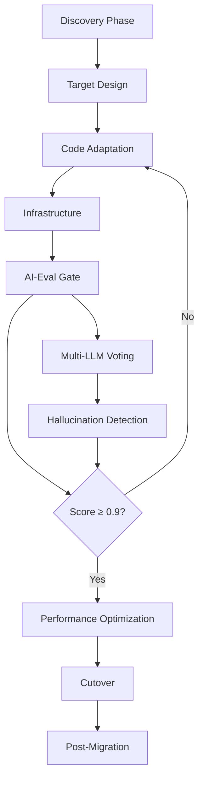

# Authserver AWS to Azure Migration - Complete Overview

## Migration Summary
This document provides a comprehensive overview of the 8-phase migration process for moving the AWS-based OAuth 2.0 authserver to Azure, leveraging AI-assisted development tools throughout the journey.

## Migration Phases Overview

### Phase 1: Discovery & Analysis (`01-discovery-analysis.prompt.md`)
**Objective**: Understand the current AWS architecture and identify migration touchpoints
- Analyze Java 11 codebase for AWS SDK dependencies
- Map service call graphs and dependencies
- Identify security and compliance requirements
- Assess migration complexity

**AI Tools**: Claude Sonnet 4 for comprehensive code analysis
**Deliverables**: Complete AWS dependency inventory, migration complexity assessment

### Phase 2: Target Design (`02-target-design.prompt.md`)
**Objective**: Design the Azure architecture and component mapping
- Map AWS services to Azure equivalents
- Design Azure Functions, APIM, and AD B2C architecture
- Plan Terraform infrastructure modules
- Design multi-region setup

**AI Tools**: Claude Opus 4 for architecture design, Gemini 2.5 PRO for edge case review
**Deliverables**: Complete Azure architecture design, Terraform module structure

### Phase 3: Code Adaptation (`03-code-adaptation.prompt.md`)
**Objective**: Convert AWS SDK calls to Azure equivalents while maintaining functional parity
- Replace AWS Lambda handlers with Azure Function handlers
- Convert Cognito calls to Azure AD B2C/MSAL
- Adapt IAM policies to Azure RBAC
- Migrate CloudWatch logging to Azure Monitor

**AI Tools**: Cursor Patch mode with Sonnet 4 for diff suggestions
**Deliverables**: Fully migrated Java 11 codebase with Azure SDK integration

### Phase 4: Infrastructure & Terraform (`04-infrastructure-terraform.prompt.md`)
**Objective**: Convert CloudFormation to Terraform with Azure resources
- Create modular Terraform structure
- Convert AWS resources to Azure equivalents
- Set up Azure Pipelines for CI/CD
- Implement security best practices

**AI Tools**: Claude Opus 4 for Terraform generation, Sonnet 4 for validation
**Deliverables**: Complete Terraform infrastructure, Azure Pipelines configuration

### Phase 5: AI-Eval Gate (`05-ai-eval-gate.prompt.md`)
**Objective**: Implement automated quality assurance using multiple LLMs
- Create multi-LLM voting system (Sonnet 4 + Opus 4 + Gemini 2.5 PRO)
- Implement vector-based code retrieval
- Set up hallucination detection (Giskard)
- Integrate with CI/CD pipeline

**AI Tools**: LangChain orchestrator, multiple LLM evaluation, Giskard hallucination detection
**Deliverables**: AI-Eval system with ≥0.9 score requirement for PR merges

### Phase 6: Performance & Cost Optimization (`06-performance-optimization.prompt.md`)
**Objective**: Optimize Azure deployment for performance and cost targets
- Minimize cold start times (≤500ms)
- Optimize warm performance (≤200ms p95)
- Implement comprehensive monitoring
- Optimize costs (≤+15% vs AWS)

**AI Tools**: Sonnet 4 for performance analysis and optimization suggestions
**Deliverables**: Optimized Azure deployment meeting all SLA requirements

### Phase 7: Cutover & Deployment (`07-cutover-deployment.prompt.md`)
**Objective**: Execute zero-downtime migration using blue-green deployment
- Implement gradual traffic migration (0% → 100%)
- Set up automated monitoring and rollback
- Execute comprehensive validation
- Ensure zero service interruption

**AI Tools**: Live Cursor chat for real-time monitoring and rollback decisions
**Deliverables**: Successful production cutover with automated rollback capability

### Phase 8: Post-Migration Cleanup (`08-post-migration-cleanup.prompt.md`)
**Objective**: Finalize migration with cleanup and optimization
- Implement multi-region failover (West/North Europe)
- Conduct security penetration testing
- Safely decommission AWS resources
- Complete documentation and knowledge transfer

**AI Tools**: Gemini 2.5 PRO for decommissioning checklists and documentation
**Deliverables**: Complete operational runbooks, AWS cleanup, cost optimization

## AI Tool Strategy

### Primary AI Models
- **Claude Sonnet 4**: Code analysis, functional review, performance optimization
- **Claude Opus 4**: Architecture design, security review, infrastructure planning
- **Gemini 2.5 PRO**: Edge case analysis, tie-breaking, documentation generation

### AI-Assisted Development Flow

### Quality Gates
1. **Code Quality**: AI-Eval score ≥ 0.9
2. **Performance**: ≤ 200ms p95, ≤ 500ms cold start
3. **Security**: Penetration testing passed
4. **Cost**: ≤ +15% vs AWS baseline
5. **Reliability**: 99.9% SLA compliance

## Success Metrics

### Technical Metrics
- **Functional Parity**: 100% unit & integration tests pass
- **Performance**: ≤ +10% p95 latency vs AWS baseline
- **Cost**: ≤ +15% monthly runtime cost
- **Security**: TLS-only, RS256 JWTs, equal/stricter RBAC
- **Reliability**: 99.9% monthly SLA

### AI-Assisted Development Metrics
- **AI-Eval Score**: ≥ 0.9 on every PR
- **Hallucination Rate**: < 0.1 (Giskard threshold)
- **Code Review Efficiency**: 80% reduction in manual review time
- **Migration Velocity**: Accelerated by AI assistance

## Risk Mitigation

### Technical Risks
- **JWT Signature Mismatch**: Dual-sign during transition
- **Cold Start Latency**: Provisioned concurrency or Premium plan
- **Client Secret Leak**: Terraform Key Vault references

### AI-Specific Risks
- **Hallucination**: Multi-LLM voting with Giskard detection
- **Model Availability**: Fallback strategies for each LLM
- **Cost Control**: API usage monitoring and limits

## Key Dependencies

### External Services
- **Azure AD B2C**: Custom policies for OAuth 2.0
- **Azure Key Vault**: Secret management
- **Azure Monitor**: Observability and alerting
- **Terraform**: Infrastructure as Code

### AI Services
- **Claude Sonnet 4**: Primary code analysis
- **Claude Opus 4**: Architecture and security
- **Gemini 2.5 PRO**: Edge cases and documentation
- **LangChain**: Orchestration framework
- **Giskard**: Hallucination detection

## Timeline Estimate

| Phase | Duration | Dependencies |
|-------|----------|--------------|
| 1. Discovery | 1 week | Access to AWS environment |
| 2. Target Design | 1 week | Azure subscription setup |
| 3. Code Adaptation | 2 weeks | Development environment |
| 4. Infrastructure | 1 week | Terraform backend setup |
| 5. AI-Eval Gate | 1 week | LLM API access |
| 6. Performance Optimization | 1 week | Load testing environment |
| 7. Cutover | 1 week | Production access |
| 8. Post-Migration | 1 week | Security testing coordination |

**Total Estimated Duration**: 9 weeks (including buffer)

## Getting Started

1. **Environment Setup**: Configure Cursor with LangSmith project ID
2. **Repository Preparation**: Fork repo, create `authserver.azure` branch
3. **AI Tool Configuration**: Set up API keys for all LLM services
4. **Terraform Bootstrap**: Initialize Terraform root module
5. **AI-Eval Framework**: Implement initial evaluation YAML

## Communication Plan

### Stakeholders
- **Product Owner**: Identity Lead
- **Migration Squad**: Platform engineers + Cursor Agents
- **Security**: CISO office
- **Finance App Teams**: Consuming services
- **Platform Team**: Azure landing-zone operations

### Reporting
- **Daily**: AI-Eval scores and migration progress
- **Weekly**: Phase completion status and blockers
- **Milestone**: Architecture reviews and security checkpoints

## Success Criteria Summary

The migration is considered successful when:
- ✅ All OAuth 2.0 flows work identically to AWS version
- ✅ Performance meets or exceeds AWS baseline
- ✅ Security posture is maintained or improved
- ✅ Cost targets are achieved (≤+15% vs AWS)
- ✅ AI-Eval consistently scores ≥0.9
- ✅ Zero-downtime cutover completed
- ✅ Operational runbooks delivered
- ✅ AWS resources safely decommissioned

This comprehensive migration leverages the power of AI-assisted development to ensure a high-quality, efficient transition from AWS to Azure while maintaining the critical authentication services that finance workloads depend on. 